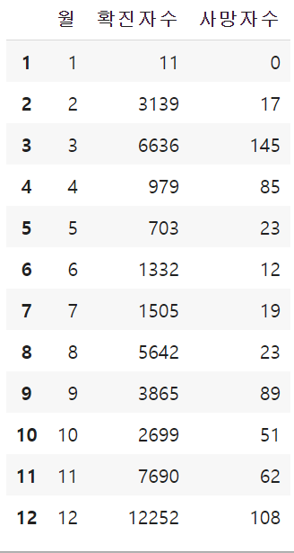
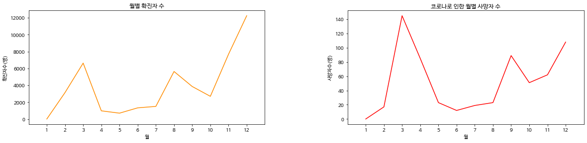
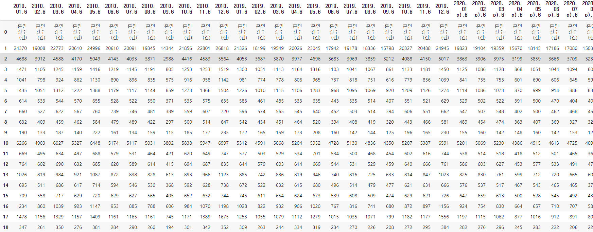
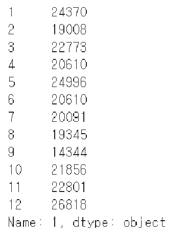
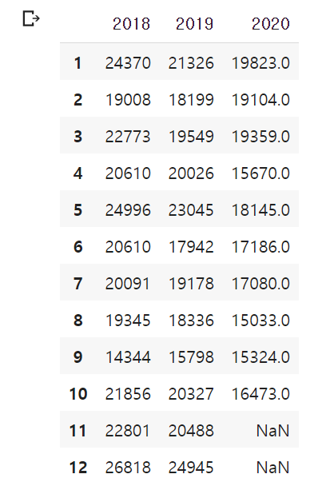
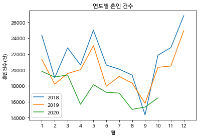

# COVID19-data-visualization

## 월별 확진자수, 사망자 수
### 데이터 형태 확인
```
from numpy import NaN, NAN, nan
import numpy as np
import pandas as pd

df = pd.read_csv('/content/drive/MyDrive/K-DIGITAL/dataset/month(MAKE).csv',thousands = ',')

df.index = df.index + 1
df = df.drop(13)
df
```
> 코드 실행 결과

columns  : 월, 확진자 수, 사망자 수
rows : 1 ~ 12 (월)



### 시각화
```
df[['확진자수', '사망자수']] = (df[['확진자수', '사망자수']]).apply(pd.to_numeric)
x1 = df['확진자수']
x2 = df['사망자수']

plt.figure(figsize=(20,10))
plt.subplots_adjust(left=0.125, bottom=0.1,  right=0.9, top=0.9, wspace=0.35, hspace=0.5)

# 1 확진자 수
plt.subplot(2,2,1)
plt.xlim([0,13])
plt.xticks(np.arange(1, 13))
plt.plot(x1,color='darkorange')

plt.title('월별 확진자 수')
plt.ylabel('확진자수(명)')
plt.xlabel('월')

# 2 사망자 수
plt.subplot(2,2,2)
plt.xlim([0,13])
plt.xticks(np.arange(1, 13))
plt.plot(x2,color='red')

plt.title('코로나로 인한 월별 사망자 수')
plt.ylabel('사망자수(명)')
plt.xlabel('월')
```

> 실행결과



## 연도별 혼인 건수
### 데이터 형태 확인

```
from numpy import NaN, NAN, nan
import pandas as pd

df = pd.read_csv('/content/drive/MyDrive/K-DIGITAL/dataset/월.분기.연간_인구동향_출생_사망_혼인_이혼통계__20201230154209.csv',encoding='ms949')

subset = []
for column in df.columns:
    if ".6" in column:
        subset.append(column)
marry = df[subset]
marry
```

> 실행결과
rows : 각 도시 별 혼인 건수
columns : 2018년 1월 ~ 2020년 11월



## 데이터 처리
### code

```
# 2018, 19, 20 년도별로 각각 list에 담는다.
marry18 = []
marry19 = []
marry20 = []
for col in marry.columns:
  if '2018.' in col:
    marry18.append(col)
  elif '2019.' in col:
    marry19.append(col)
  elif '2020.' in col:
    marry20.append(col)

print(marry18)
print(marry19)
print(marry20)
```
```
# 2018, 2019, 2020 으로  data frame 나누기
y2018 = df[marry18].loc[1,:]
y2019 = df[marry19].loc[1,:]
y2020 = df[marry20].loc[1,:]
```
```
# 1월 ~ 12월 인덱싱
li = ['1','2','3','4','5','6','7','8','9','10','11','12']
y2018.index = li
y2018
```
```
y2019.index = li
y2019
```
```
# 2020년 데이터는 10월까지밖에 없기 때문에 10월까지만 다룸
y2020.index = li[0:10]
y2020
```




```
# 2020년 11,12월 데이터가 없기 때문에 NAN
type(y2020)
y2020.loc['11']=NAN
y2020.loc['12']=NAN
```
```
# 문자열 데이터를 numeric으로 변경
column_name = ['2018', '2019', '2020']
df1 = pd.DataFrame({
    '2018': y2018.values,
    '2019': y2019.values,
    '2020': y2020.values,
})
df1[['2018', '2019','2020']] = df1[['2018', '2019','2020']].apply(pd.to_numeric)
df1.index = df1.index + 1

df1
```



## 시각화
```
import numpy as np
df1.plot.line()

plt.title('연도별 혼인 건수')
plt.ylabel('혼인건수(건)')
plt.xlabel('월')
plt.xlim([0,13])
plt.xticks(np.arange(1, 13))
plt.figure(figsize=(10,5))
plt.subplots_adjust(left=0.125, bottom=0.1,  right=0.9, top=0.9, wspace=0.35, hspace=0.5)
```
> 실행결과

